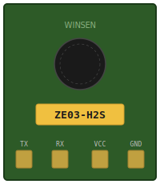

# Wokwi ZE03-H2S Custom Chip

A [Wokwi](https://wokwi.com/) custom chip simulating the **Winsen ZE03-H2S** electrochemical hydrogen sulfide (H2S) gas sensor module (UART variant).

<p align="center">
  
</p>

## Usage

Add the chip to your Wokwi project by referencing it in `diagram.json`:

```json
{
  "type": "chip-ze03-h2s",
  "id": "sensor1",
  "attrs": { "h2s_ppm": "2.0" }
}
```

Or use the published release:

```json
{
  "dependencies": {
    "chip-ze03-h2s": "github:7ax/wokwi-chip-ze03-h2s@1.0.0"
  }
}
```

## Pin Connections

| Chip Pin | Description        | Arduino Example |
|----------|--------------------|-----------------|
| TX       | Sensor data output | Digital pin 2   |
| RX       | Command input      | Digital pin 3   |
| VCC      | Power supply       | 5V              |
| GND      | Ground             | GND             |

## Protocol

UART: **9600 baud, 8N1**

The chip implements the standard ZE03 module UART protocol with two operating modes:

### Active Upload Mode (default)

The sensor transmits a 9-byte frame every 1 second:

```
FF 04 03 [HH] [LL] 00 00 00 [CS]
```

- Bytes 3-4: H2S concentration (high/low byte), value = ppm x 100
- Byte 8: Checksum = `(~(sum of bytes 1-7) + 1) & 0xFF`

### Q&A Mode

Send the query command to read concentration on demand:

```
Query:    FF 86 00 00 00 00 00 00 7A
Response: FF 86 [HH] [LL] 00 00 00 00 [CS]
```

### Mode Switching

```
Switch to Q&A mode:     FF 01 78 41 00 00 00 00 46
Switch to active mode:  FF 01 78 40 00 00 00 00 47
```

## Specifications

| Parameter       | Value          |
|-----------------|----------------|
| Detection range | 0 - 100 ppm   |
| Resolution      | 0.01 ppm       |
| Default value   | 2.00 ppm       |

### H2S Safety Thresholds

| Level    | Concentration | Effect                          |
|----------|---------------|---------------------------------|
| Caution  | > 10 ppm      | Toxic to dogs (immediate danger)|
| Danger   | > 20 ppm      | Life-threatening                |

## Building from Source

Using Docker (recommended):

```bash
docker run --rm -v ${PWD}:/src wokwi/builder-clang-wasm:latest make -C /src
```

Output files are written to `dist/`.

## License

[MIT](LICENSE)
